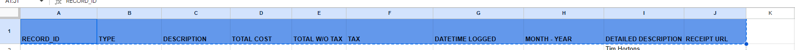

# REQUIREMENTS

### For Telegram Nodes

- Create telegram bot
- Get telegram bot token

- Create bot commands: 
    - /picture
    - /manual

### For Google Drive and Sheets Nodes

- Create Porject
- Enable Google Sheets API
- Create a Service Account (for google sheets)
- Get Email and Private Key
- Create OAuth 2.0 Client (for google drive)
- Get Client ID and Client Secret 
- Sign in you Google Account
- Also, please add your service account as editor on the sheets

For Google Sheets Headers (A1,B1, ... )
  - RECORD_ID	TYPE, DESCRIPTION, TOTAL COST, TOTAL W/O TAX, TAX, DATETIME LOGGED, MONTH - YEAR, DETAILED DESCRIPTION, RECEIPT URL

For Google Drive Folder
 - Craete a folder on your My Drive

### For Google Gemini Chat Node

- Go to Google AI studio
- Create a API key

### Ngrok

- Create Account
- Get auth token
- setup in env 